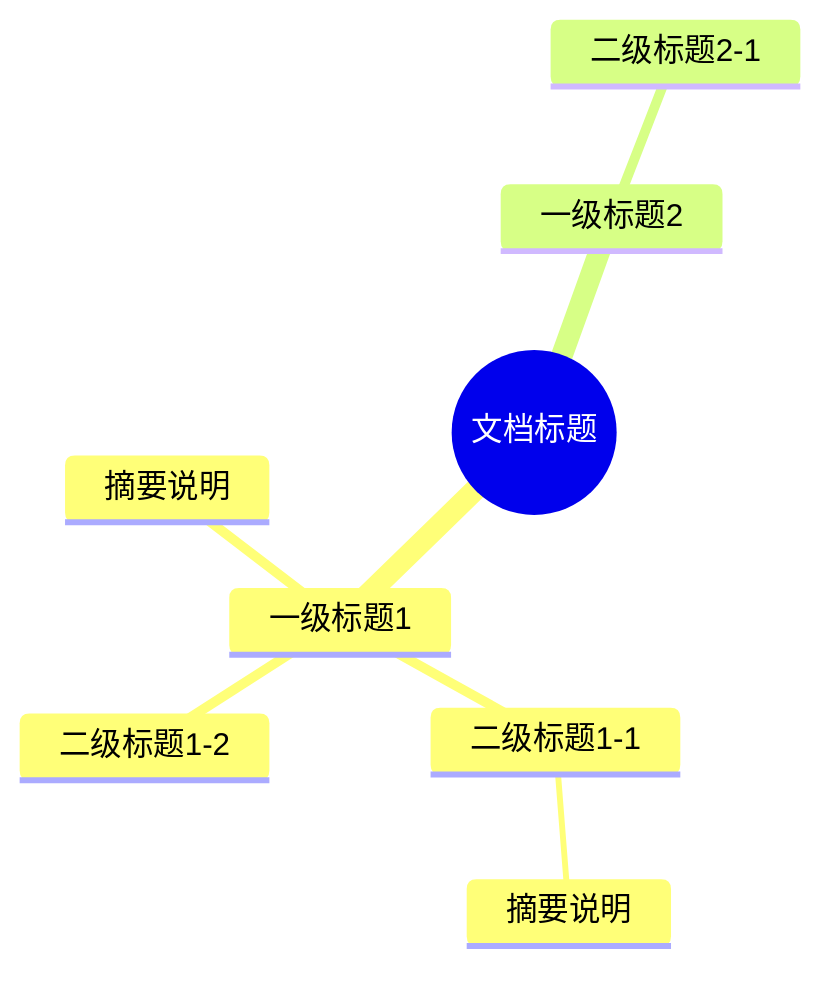

# MD / 飞书文档 → 思维导图

将文档（本地 Markdown 文件或飞书文档）的结构解析出来，生成 Mermaid 思维导图，
嵌入或更新飞书文档中的画板，帮助用户一眼看清文档骨架。

## 两种工作模式

根据用户输入类型，自动选择对应模式：

### 模式 A：本地 MD 文件 → 新建飞书文档

用户提供本地 `.md` 文件路径时，读取文件 → 解析结构 → 创建新飞书文档（含思维导图画板）。

### 模式 B：飞书文档 URL → 更新已有画板

用户提供飞书文档 URL 时，读取文档内容 → 解析结构 → 更新文档中已有的画板为思维导图。
**这是默认推荐模式**，因为用户已经在飞书文档中工作，不需要创建新文档。

---

## 必答问题：在生成画板前必须询问

**在创建飞书文档或写入画板之前，无论是模式 A 还是模式 B，都必须先通过 `AskUserQuestion` 工具询问用户两个问题。两个问题在一次 `AskUserQuestion` 调用中一起问，不要分两次问。**

### 问题 1：语言选择

文档源文件可能是任何语言（英文、中文、日文等）。模型有把英文文档自动翻译成中文的倾向，但用户的实际需求可能是保留原文（例如英文 SKILL 文档保留英文术语更准确）。**这个选择会显著影响最终画板的呈现，必须让用户明确选择，不要替用户决定。**

- header：`Language`（≤ 12 字）
- question：`思维导图节点的文字使用哪种语言？`
- 选项（固定两个，不要自行扩展）：
  1. `保持原文` — 描述："直接使用源文档中的文字，保留原始术语和措辞（推荐用于技术文档、专有名词、英文资料）"
  2. `翻译为中文` — 描述："将节点文字翻译为简体中文，便于中文读者快速理解"

用户选择"保持原文"时，节点文字必须严格使用源文档中出现的字符串（包括大小写、标点），不做任何翻译、改写或归纳；摘要可以截断但不能改写。

### 问题 2：内容深度

思维导图可以只展示骨架（仅标题层级），也可以在每个标题节点下附带简短摘要。骨架更紧凑、一眼看清结构；带摘要信息更丰富，但节点更多、布局更密。**默认两种都合理，必须让用户决定。**

- header：`Depth`（≤ 12 字）
- question：`思维导图包含哪些内容？`
- 选项（固定两个，不要自行扩展）：
  1. `仅标题骨架` — 描述："只展示标题层级（h1-h9 及对应飞书 block 标题），节点紧凑，一眼看清文档结构"
  2. `标题加简短摘要` — 描述："每个标题节点下附带一句话摘要（≤ 30 字），信息更丰富但节点更密集（推荐用于内容较少的文档）"

用户选择"仅标题骨架"时：
- **不要生成任何摘要节点**，只输出标题节点（含飞书文档中的 callout/checkbox/table 等非标题块也省略，除非用户在后续追加要求）
- 模式 B 中飞书文档的 callout、checkbox、table、grid 等非标题块**全部跳过**，只保留 h1-h9
- 模式 A 中跳过段落首句摘要的提取

用户选择"标题加简短摘要"时：
- 按原有规则提取摘要（首句、≤ 30 字）
- 模式 B 中按表格保留 callout/checkbox/table 简化版作为子节点

### 询问时机

- **模式 A**：读完 MD 文件、识别出标题结构之后，**调用 `docs +create` 之前**
- **模式 B**：读完飞书文档、解析出结构之后，**调用 `whiteboard +update` 之前**

用户两个问题都回答后再继续后续步骤。

---

## 模式 A：本地 MD 文件 → 新建飞书文档

### Step A1: 解析 MD 文档结构

读取用户指定的 MD 文件，提取：

- **标题层级**：h1 ~ h6，保留缩进关系
- **简短摘要**：每个标题节的第一段非空文本，截取到第一个句号/问号/感叹号为止（最长 30 字）。如果没有正文内容，则不标注摘要

解析规则：
- `#` → h1，`##` → h2，以此类推
- 忽略纯 YAML front matter（`---` 之间的内容）
- 标题间的正文只取第一句作为摘要，不做深度内容提取
- 如果标题本身超过 20 字，在思维导图中截断到 20 字并加 `…`

### Step A2: 生成 Mermaid Mindmap

**先执行「必答问题：语言选择 + 内容深度」**（一次 `AskUserQuestion` 调用包含两个问题），根据用户选择决定节点文字的语言和是否包含摘要。

将解析结果转换为 Mermaid mindmap 语法。详见下方「Mermaid Mindmap 生成规范」。

### Step A3: 创建飞书文档

使用 `lark-cli docs +create` 创建文档：

```bash
lark-cli docs +create --api-version v2 --content '<title>📋 [文件名] 结构导图</title>
<callout emoji="🗺️"><p>本文档由 md2mindmapinlarkdoc 自动生成，展示原始 Markdown 文档的结构层级与摘要。</p></callout>
<h2>结构思维导图</h2>
<whiteboard type="blank"></whiteboard>'
```

从返回的 JSON 中提取：
- `document_id` — 用于后续操作
- `url` — 最终交付给用户
- `data.board_tokens[0]` — 画板 token，用于下一步写入

### Step A4: 写入画板

```bash
cat > /tmp/mindmap.mmd << 'EOF'
<Mermaid mindmap 内容>
EOF

lark-cli whiteboard +update \
  --whiteboard-token <board_token> \
  --input_format mermaid \
  --source @/tmp/mindmap.mmd \
  --overwrite --as user
```

> **注意**：`--source` 参数要求文件路径是相对路径，必须先在文件所在目录 `cd` 到 `/tmp`（或其他可写目录），再用 `./filename` 形式引用。

### Step A5: 交付

向用户报告飞书文档 URL、节点统计信息。详见下方「交付规范」。

---

## 模式 B：飞书文档 URL → 更新已有画板

这是处理飞书文档中已有画板的推荐方式。

### Step B1: 读取飞书文档

先用 `lark-doc` skill 读取文档，获取完整内容和所有 block ID：

```bash
lark-cli docs +fetch --api-version v2 --doc "<文档URL>" --detail with-ids
```

从返回的 `content` 中：
1. **解析文档结构**：提取所有有意义的块（标题 h1-h9、表格、callout、checkbox、grid、段落等）
2. **定位画板 whiteboard**：找到 `<whiteboard>` 标签，提取其 `token` 和 `id`

### Step B2: 解析飞书文档结构

飞书文档的 XML 内容需要解析为思维导图节点。提取以下类型：

| XML 标签 | 解析方式 |
|----------|----------|
| `<title>` | 作为根节点 |
| `<h1>` ~ `<h9>` | 作为对应层级的标题节点 |
| `<callout emoji="...">` | 取 emoji + 内容首句，作为子节点 |
| `<checkbox done="...">` | 取内容，作为子节点，前缀 ☐ 或 ☑ |
| `<table>` | 提取表头行和关键数据行（最多 5 行），作为子节点 |
| `<grid>` + `<column>` | 提取分栏中的 callout/标题，标注"分栏" |
| `<p>` 含 `<b>` 的段落 | 作为摘要节点 |

解析原则：
- 标题层级按 h1-h9 映射到思维导图层级
- 非标题块（callout、checkbox、table）作为其上方最近标题的子节点
- 表格内容提取 thead 中 th 的文字作为列头，tbody 中每行取关键字段拼接
- 节点文字中如果含有 Mermaid 特殊字符 `()[]{}:;` 等，用双引号包裹
- 如果某个节点下子节点过多（> 15 个），省略非关键摘要以减少视觉密度

### Step B3: 生成 Mermaid Mindmap

**先执行「必答问题：语言选择 + 内容深度」**（一次 `AskUserQuestion` 调用包含两个问题），根据用户选择决定节点文字的语言和是否包含摘要/非标题块。

将解析结果转换为 Mermaid mindmap 语法。详见下方「Mermaid Mindmap 生成规范」。

### Step B4: 更新已有画板

直接用 `lark-cli` 更新文档中已有的画板，**不需要创建新文档**：

```bash
cd /tmp
cat > mindmap.mmd << 'EOF'
<Mermaid mindmap 内容>
EOF

lark-cli whiteboard +update \
  --whiteboard-token <从 whiteboard 标签提取的 token> \
  --input_format mermaid \
  --source @./mindmap.mmd \
  --overwrite --as user
```

> **关键**：`--source` 必须是相对路径。先 `cd` 到文件所在目录，再使用 `@./filename` 形式。

### Step B5: 交付

向用户报告文档 URL、画板更新完成、节点统计。详见下方「交付规范」。

---

## Mermaid Mindmap 生成规范

### 语法格式



### 生成规则

1. `root((文档标题))` — 取文档标题或文件名作为根节点
2. **严格遵守源文档的标题层级，不得改写父子关系**：
   - `h1` 是 root 的直接子节点；`h2` 必须是其上方最近的 `h1` 的子节点；`h3` 必须是其上方最近的 `h2` 的子节点；依此类推
   - 这条规则同样适用于飞书文档 XML 中的 `<h1>`-`<h9>`
   - **常见错误**：把深层标题（如 h3）误当成顶层分支并列展示。生成前请逐项核对：每一个标题节点的缩进层级是否等于源文档中它的 `#` 数减一
   - **不要因为标题"看起来重要"就把它提到更高层级**，也不要因为某节内容多就把它"扁平化"以求布局好看
3. 非标题块（callout、checkbox、table 等）作为其上方最近标题的子节点（缩进 = 该标题缩进 + 1）
4. 摘要作为标题节点的子节点，用普通文本（不加括号），如果摘要为空则不添加
5. 节点文字中如果含有 Mermaid 特殊字符 `()[]{}:;&` 等，**用方括号 `[...]` 包裹**而不是引号：
   - ✅ `[Phase 0: Detect Mode]`
   - ❌ `"Phase 0: Detect Mode"` —— 引号节点后若再跟子节点会报 `Parse error` (Expecting 'SPACELINE', 'NL', 'EOF', got 'NODE_ID')
   - 方括号语法对叶子节点和有子节点的节点都安全
6. 不限制节点数量，全部展示
7. 特殊字符处理：`&lt;` → `<`，`&gt;` → `>`，`&amp;` → `&`（XML 实体解码后再写入 Mermaid）

### 生成前自检（必做）

在写入画板前，对照源文档逐条核对：
- 每个标题节点的缩进层级是否 = 源文档中它的层级（h1=1, h2=2, h3=3, …）？
- 是否有 h3/h4 被错误地提升为 h1 同级？
- 子节点的归属是否正确（它确实在源文档中位于这个父标题之下）？

若有偏差，修正后再写入。

### 大文件处理

对于节点很多的文档，Mermaid 会自动处理布局。但为了让思维导图可读性更好：
- 摘要尽量简短（≤ 30 字），避免单个节点文字过多
- 如果某个 h1 下子节点特别多（> 15 个直接子节点），考虑将摘要省略以减少视觉密度

---

## 交付规范

操作完成后，向用户报告：

1. 飞书文档 URL（模式 A 新建的 URL，模式 B 原文档 URL）
2. 画板更新完成确认
3. 简要说明解析到的内容统计

示例：
```
✅ 思维导图已生成！

📄 飞书文档：https://[your-domain].feishu.cn/docx/[document_id]

统计信息：
- 标题节点：8 个
- 表格：1 个
- Callout：3 个
- Checkbox：3 个
- 分栏：1 组

打开文档即可查看思维导图画板。
```

---

## 依赖

- `lark-cli` — 飞书命令行工具（需已认证）
- `lark-doc` skill — 文档读取和创建
- `lark-whiteboard` skill — 画板写入（需要时查阅）

## 边界情况

- **用户没有指定输入**：询问用户要分析哪个文件或飞书文档
- **MD 文件不存在或无法读取**：明确报错，提示用户检查路径
- **飞书文档无法读取**：检查认证状态，提示用户授权
- **文档没有标题结构**：提示用户该文档没有明显的层级结构，仅基于其他元素（表格、callout 等）生成扁平导图
- **文档中没有画板（模式 B）**：提示用户文档中没有画板，改为创建新画板
- **lark-cli 认证失败**：提示用户运行 `lark-cli config init` 完成认证
- **画板写入失败**：检查 board_token 是否正确；确认 `--source` 使用了相对路径（如 `@./mindmap.mmd`）而非绝对路径；重试一次；仍失败则将 Mermaid 代码提供给用户
