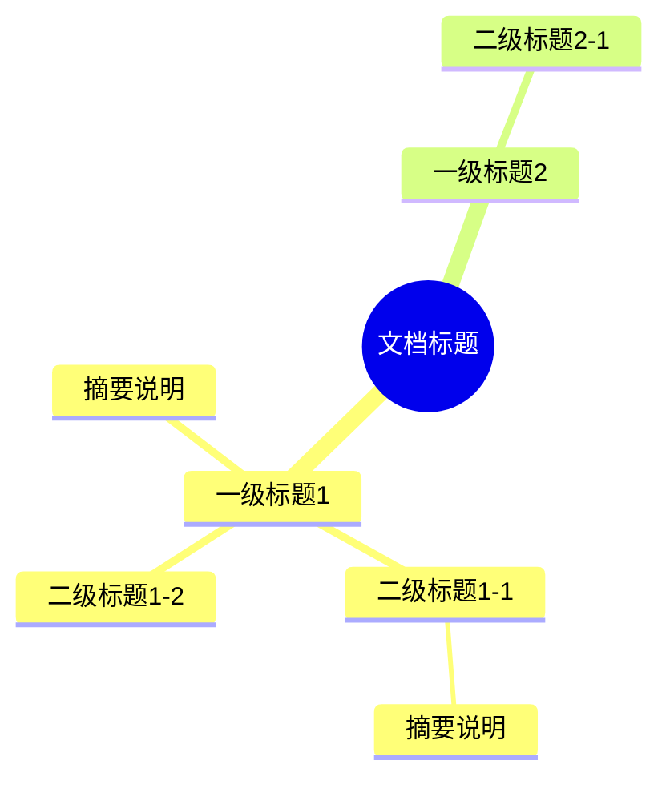

# Markdown → 飞书思维导图

将 Markdown 文档（本地或在线）的结构解析出来，生成 Mermaid 思维导图，
**新建**一个飞书文档并把思维导图嵌入文档中的画板，帮助用户一眼看清文档骨架。

## 两种输入模式

两种模式的产出完全一致：**新建飞书文档 + 思维导图画板**。区别只在于 MD 内容从哪里读：

### 模式 A：本地 MD 文件

用户提供本地 `.md` 文件路径（如 `~/Documents/foo.md`、`./README.md`），用 `Read` 工具读取后解析。

### 模式 B：在线 MD URL

用户提供一个指向 Markdown 文本的 URL，常见来源：
- GitHub raw：`https://raw.githubusercontent.com/owner/repo/branch/path/to/file.md`
- GitHub 普通文件页（`https://github.com/owner/repo/blob/...`）→ 自动转成 raw 后再下载
- 其他直接返回 markdown 文本的 HTTP(S) 链接

用 `WebFetch` 或 `curl` 拉取原始 markdown 文本后解析。

> **不在范围内**：解析飞书文档 / Notion / Confluence / 其他在线富文本系统的结构——这个 skill 只处理"纯 Markdown 文本"。

---

## 必答问题：在生成画板前必须询问

**在创建飞书文档之前，无论是模式 A 还是模式 B，都必须先通过 `AskUserQuestion` 工具询问用户两个问题。两个问题在一次 `AskUserQuestion` 调用中一起问，不要分两次问。**

### 问题 1：语言选择

文档源文件可能是任何语言（英文、中文、日文等）。模型有把英文文档自动翻译成中文的倾向，但用户的实际需求可能是保留原文（例如英文 README 保留英文术语更准确）。**这个选择会显著影响最终画板的呈现，必须让用户明确选择，不要替用户决定。**

- header：`Language`（≤ 12 字）
- question：`思维导图节点的文字使用哪种语言？`
- 选项（固定两个，不要自行扩展）：
  1. `保持原文` — 描述："直接使用源文档中的文字，保留原始术语和措辞（推荐用于技术文档、专有名词、英文资料）"
  2. `翻译为中文` — 描述："将节点文字翻译为简体中文，便于中文读者快速理解"

用户选择"保持原文"时，节点文字必须严格使用源文档中出现的字符串（包括大小写、标点），不做任何翻译、改写或归纳；摘要可以截断但不能改写。

### 问题 2：内容深度

思维导图可以只展示骨架（仅标题层级），也可以在每个标题节点下附带简短摘要。骨架更紧凑、一眼看清结构；带摘要信息更丰富，但节点更多、布局更密。**默认两种都合理，必须让用户决定。**

- header：`Depth`（≤ 12 字）
- question：`思维导图包含哪些内容？`
- 选项（固定两个，不要自行扩展）：
  1. `仅标题骨架` — 描述："只展示标题层级（h1-h6），节点紧凑，一眼看清文档结构"
  2. `标题加简短摘要` — 描述："每个标题节点下附带一句话摘要（≤ 30 字），信息更丰富但节点更密集（推荐用于内容较少的文档）"

用户选择"仅标题骨架"时：**不要生成任何摘要节点**，只输出标题节点。

用户选择"标题加简短摘要"时：按下方「Step 1: 解析 MD 文档结构」中的摘要规则提取（首句、≤ 30 字）。

### 询问时机

读完 MD 内容、识别出标题结构之后，**调用 `docs +create` 之前**。两个问题都回答后再继续。

---

## Step 1: 获取并解析 MD 文档

### 1.1 获取 MD 文本

| 模式 | 怎么拿到 markdown 文本 |
|------|------------------------|
| A 本地路径 | `Read` 工具直接读 |
| B GitHub blob URL | 转成 raw URL（`github.com/.../blob/...` → `raw.githubusercontent.com/.../...`），再用 `WebFetch` 拉取 |
| B GitHub raw URL | 直接 `WebFetch` |
| B 其他 HTTP(S) MD 链接 | 直接 `WebFetch`；如果返回不是 markdown（HTML 渲染页），提示用户给 raw 链接 |

### 1.2 解析结构

提取：

- **标题层级**：h1 ~ h6，保留缩进关系
- **简短摘要**（仅当用户选了"标题加简短摘要"）：每个标题节的第一段非空文本，截取到第一个句号/问号/感叹号为止（最长 30 字）。如果没有正文内容，则不标注摘要

解析规则：
- `#` → h1，`##` → h2，以此类推
- 忽略纯 YAML front matter（开头 `---` 之间的内容）
- 忽略代码块内（` ``` ` 围起的部分）出现的"#"，那些不是标题
- 标题间的正文只取第一句作为摘要，不做深度内容提取
- 如果标题本身超过 20 字，在思维导图中截断到 20 字并加 `…`

---

## Step 2: 询问用户（必答问题）

执行上面「必答问题」一节描述的 `AskUserQuestion` 调用，拿到 Language 和 Depth 两个选择。

---

## Step 3: 生成 Mermaid Mindmap

将解析结果转换为 Mermaid mindmap 语法。详见下方「Mermaid Mindmap 生成规范」。
根据用户在 Step 2 的选择决定节点文字的语言和是否包含摘要。

---

## Step 4: 创建飞书文档（含空白画板占位）

使用 `lark-cli docs +create` 创建文档：

```bash
lark-cli docs +create --api-version v2 --content '<title>📋 [文件名] 结构导图</title>
<callout emoji="🗺️"><p>本文档由 md2mindmapinlarkdoc 自动生成，展示原始 Markdown 文档的结构层级。</p></callout>
<h2>结构思维导图</h2>
<whiteboard type="blank"></whiteboard>'
```

从返回的 JSON 中提取：
- `data.document.url` — 最终交付给用户
- `data.document.new_blocks[0].block_token`（type 为 `whiteboard` 的那条）— 画板 token，用于 Step 5 写入

> **文件名取法**：模式 A 取本地路径的 basename（去 `.md` 后缀）；模式 B 取 URL 最后一段（去 `.md` 后缀）；若 MD 首行有 h1，可优先用 h1 文本。

---

## Step 5: 写入思维导图到画板

`lark-cli` 原生支持 `--input_format mermaid`，无需额外工具。

```bash
cd /tmp
cat > mindmap.mmd << 'EOF'
<Mermaid mindmap 内容>
EOF

lark-cli whiteboard +update \
  --whiteboard-token <Step 4 拿到的 block_token> \
  --input_format mermaid \
  --source @./mindmap.mmd \
  --overwrite --as user
```

> **关键**：`--source` 必须是相对路径（如 `@./mindmap.mmd`）。绝对路径（如 `@/tmp/mindmap.mmd`）会报错。先 `cd` 到文件所在目录，再用 `@./filename` 形式引用。

---

## Step 6: 交付

向用户报告飞书文档 URL、节点统计。详见下方「交付规范」。

---

## Mermaid Mindmap 生成规范

### 语法格式



### 生成规则

1. `root((文档标题))` — 取文档标题或文件名作为根节点
2. **严格遵守源文档的标题层级，不得改写父子关系**：
   - `h1` 是 root 的直接子节点；`h2` 必须是其上方最近的 `h1` 的子节点；`h3` 必须是其上方最近的 `h2` 的子节点；依此类推
   - **常见错误**：把深层标题（如 h3）误当成顶层分支并列展示。生成前请逐项核对：每一个标题节点的缩进层级是否等于源文档中它的 `#` 数减一
   - **不要因为标题"看起来重要"就把它提到更高层级**，也不要因为某节内容多就把它"扁平化"以求布局好看
3. 摘要作为标题节点的子节点，用普通文本（不加括号），如果摘要为空则不添加
4. 节点文字中如果含有 Mermaid 特殊字符 `()[]{}:;&` 等，**用方括号 `[...]` 包裹**而不是引号：
   - ✅ `[Phase 0: Detect Mode]`
   - ❌ `"Phase 0: Detect Mode"` —— 引号节点后若再跟子节点会报 `Parse error` (Expecting 'SPACELINE', 'NL', 'EOF', got 'NODE_ID')
   - 方括号语法对叶子节点和有子节点的节点都安全
5. 不限制节点数量，全部展示
6. 特殊字符处理：HTML 实体（如 `&lt;`, `&gt;`, `&amp;`）解码后再写入 Mermaid

### 生成前自检（必做）

在写入画板前，对照源文档逐条核对：
- 每个标题节点的缩进层级是否 = 源文档中它的层级（h1=1, h2=2, h3=3, …）？
- 是否有 h3/h4 被错误地提升为 h1 同级？
- 子节点的归属是否正确（它确实在源文档中位于这个父标题之下）？

若有偏差，修正后再写入。

### 大文件处理

对于节点很多的文档，Mermaid 会自动处理布局。但为了让思维导图可读性更好：
- 摘要尽量简短（≤ 30 字），避免单个节点文字过多
- 如果某个 h1 下子节点特别多（> 15 个直接子节点），考虑将摘要省略以减少视觉密度

---

## 交付规范

操作完成后，向用户报告：

1. 飞书文档 URL（Step 4 返回的 `data.document.url`）
2. 简要说明解析到的标题数量和层级深度

示例：
```
✅ 思维导图已生成！

📄 飞书文档：https://[your-domain].feishu.cn/docx/[document_id]

统计信息：
- 标题节点：23 个
- 最大层级深度：4 层
- 含摘要节点：18 个（或：仅标题骨架）

打开文档即可查看结构思维导图画板。
```

---

## 依赖

- `lark-cli` — 飞书命令行工具（需已认证）
- `lark-doc` skill — 文档创建参考
- `lark-whiteboard` skill — 画板写入参考

## 边界情况

- **用户没有指定输入**：询问用户要分析哪个 MD 文件或在线 MD URL
- **本地 MD 文件不存在或无法读取**：明确报错，提示用户检查路径
- **在线 MD URL 拉取失败 / 不是 markdown**：提示用户检查 URL；若是 GitHub blob 页面，建议用 raw URL
- **MD 文件没有任何标题**：提示用户该文件没有 Markdown 标题结构，无法生成有层级的思维导图（可询问是否仍要继续，把段落首句作为扁平节点）
- **lark-cli 认证失败**：提示用户运行 `lark-cli config init` 完成认证
- **画板写入失败**：检查 board_token 是否正确；确认 `--source` 使用了相对路径（如 `@./mindmap.mmd`）而非绝对路径；重试一次；仍失败则将 Mermaid 代码提供给用户，让其手动创建画板
